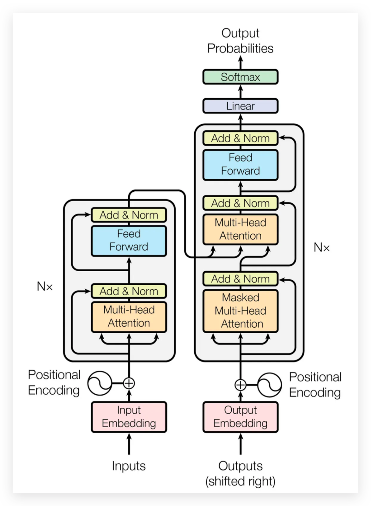

# WORKSHOP: INTRODUÇÃO À ARQUITETURA TRANSFORMER E VISION TRANSFOMER PARA APLICAÇÕES EM SAÚDE



## Sobre o workshop
Este repositório reúne o material utilizado em um workshop de introdução à arquitetura Transformer. O foco é combinar explicações conceituais com atividades práticas em notebooks, culminando em exemplos reais de uso com modelos inspirados no BERT para texto e no Vision Transformer (ViT) para visão computacional.

## O que você vai encontrar
- Uma trilha guiada de notebooks que explica passo a passo os blocos fundamentais de um Transformer: tokenização, atenção, normalização e feed-forward.
- Utilidades e figuras que ajudam a visualizar os conceitos mais importantes.
- Pipelines completos que aplicam Transformers em dois cenários distintos:
  - **Mini BERT** para entender um modelo de linguagem focado em textos clínicos.
  - **Mini ViT** para classificação de imagens médicas.

## Estrutura do repositório
```
.
├── blocks/                  # Notebooks educacionais com os blocos da arquitetura
│   ├── 0-word_to_numbers.ipynb
│   ├── 1-attention.ipynb
│   ├── 2-layer_norm.ipynb
│   ├── 3-feed_forward.ipynb
│   └── figures/             # Imagens de apoio usadas nos notebooks
├── exemplos/                # Casos completos de aplicação
│   ├── 1-mini_bert_anamnese.ipynb
│   ├── 2-mini_vit.ipynb
│   ├── 3-desafio_multimodal*.ipynb
│   ├── data/                # Arquivos CSV utilizados nos experimentos
│   ├── model.py / tokenizer.py / trainer.py
│   └── utils.py             # Funções auxiliares de visualização e métricas
├── transformer.png          # Figura geral da arquitetura Transformer
└── README.md
```

## Requisitos
- Python 3.10 ou superior.
- Biblioteca Jupyter (Notebook ou Lab) para executar os arquivos `.ipynb`.
- Pacotes científicos principais:
  - `torch`, `torchvision` (para os modelos e treinamento)
  - `numpy`, `pandas`
  - `matplotlib`, `seaborn`, `plotly`
  - `scikit-learn`, `imbalanced-learn`
  - `einops`

> Dica: crie um ambiente virtual dedicado (via `venv`, `conda` ou `mamba`) para isolar as dependências do workshop.

## Como começar
1. **Clone o repositório**
   ```bash
   git clone https://github.com/peuBouzon/workshop-transformers.git
   cd workshop-transformers
   ```
2. **Crie e ative um ambiente com as dependências do `requirements.txt`**

   > Escolha a abordagem que preferir. As duas alternativas abaixo usam o mesmo arquivo `requirements.txt` presente na raiz do projeto.

   ### Opção A — Conda
   ```bash
   conda create -n workshop-transformers python=3.10 -y
   conda activate workshop-transformers
   pip install -r requirements.txt
   ```

   ### Opção B — Ambiente virtual (`venv`)
   ```bash
   python -m venv .venv
   source .venv/bin/activate  # No Windows use: .venv\Scripts\activate
   pip install --upgrade pip
   pip install -r requirements.txt
   ```

3. **Inicie o Jupyter Notebook ou VS Code**
   ```bash
   jupyter lab
   # ou
   jupyter notebook
   ```
4. **Abra os notebooks em `blocks/` e siga as instruções do workshop.**

## Notebooks didáticos (`blocks/`)
Cada notebook aborda um componente fundamental do Transformer:
- `0-word_to_numbers.ipynb`: Pré-processamento textual e tokenização básica.
- `1-attention.ipynb`: Implementação e visualização da atenção escalonada.
- `2-layer_norm.ipynb`: Normalização de camadas e sua importância para estabilidade.
- `3-feed_forward.ipynb`: Camadas feed-forward e integração com dropout.

Os notebooks são independentes, mas recomendados na ordem apresentada para acompanhar a narrativa do workshop.

## Exemplos aplicados (`exemplos/`)
- **Mini BERT para anamnese** (`1-mini_bert_anamnese.ipynb`): pipeline completo de carregamento de dados, tokenização, treinamento e avaliação de um modelo textual. O script `trainer.py` abstrai o laço de treino e já calcula métricas como *recall*, *precision* e *specificity*.
- **Mini Vision Transformer** (`2-mini_vit.ipynb`): demonstra como adaptar a arquitetura Transformer para visão computacional usando embeddings de patches. Inclui funções utilitárias para visualizar distribuições de classes e curvas ROC/PR.
- **Desafio multimodal** (`3-desafio_multimodal*.ipynb`): reúne sinal de texto e imagem para explorar cenários onde múltiplas modalidades se complementam.

## Dados de exemplo
A pasta `exemplos/data/` contém pequenos datasets como `skincancer.csv` e `transcription.csv`, utilizados para as demonstrações. São amostras sintéticas ou reduzidas, adequadas para fins educacionais. Ajuste o caminho dos arquivos caso deseje substituir pelos seus próprios dados.

## Materiais de apoio
- A pasta `blocks/figures/` concentra ilustrações (atenção, dropout, tokenização, etc.) que complementam os notebooks.

## Próximos passos sugeridos
- Atualizar `requirements.txt` com versões fixadas para facilitar a instalação reprodutível.

PS: Este README foi gerado automaticamente, qualquer problema abra uma issue no repositório que respondo.